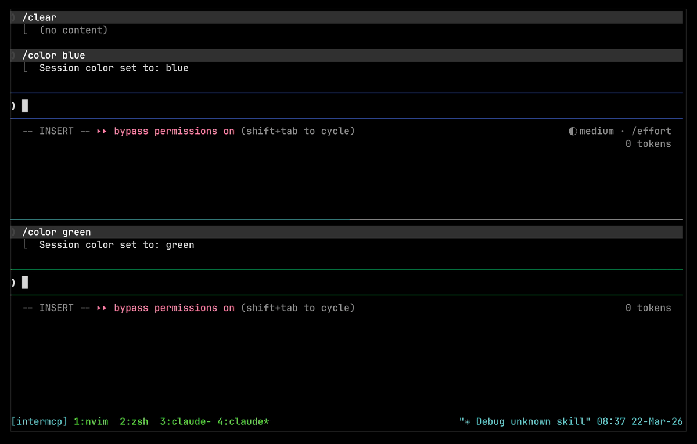

# intermcp

An MCP server that lets Claude Code agents talk to each other.

<p align="center">
  
</p>

## Why

Claude Code has subagents, but they aren't truly independent — they run within
the same session, share context, and execute sequentially. When you actually want
multiple agents working in parallel on the same codebase — say one building a
feature and another writing tests — you need separate Claude Code sessions. But
those sessions have no idea the other exists. They step on each other's changes,
duplicate work, or make conflicting edits.

intermcp fixes this by giving every agent a way to discover and message other
running agents in real time, using Claude Code's
[channels](https://code.claude.com/docs/en/channels) to push messages directly
into each session.

## How it works

```
Agent A ←stdio→ [intermcp serve] ←tcp→ [intermcp daemon] ←tcp→ [intermcp serve] ←stdio→ Agent B
```

Each Claude Code instance spawns an `intermcp serve` process as its MCP server.
These connect to a shared `intermcp daemon` running on localhost. The daemon
routes messages between agents. Messages are delivered instantly via Claude
Code's [channels](https://code.claude.com/docs/en/channels) — no polling
required.

The daemon auto-starts when the first agent connects and stays alive across
sessions.

## Setup

Build the binary:

```sh
go build -o intermcp .
```

Add it to your `.mcp.json` (already included in this repo):

```json
{
  "mcpServers": {
    "intermcp": {
      "command": "/path/to/intermcp",
      "args": ["serve"]
    }
  }
}
```

Start Claude Code with channels enabled:

```sh
claude --dangerously-load-development-channels server:intermcp
```

That's it. Every Claude Code session started this way can now see and message
every other one.

## Tools

Agents get three tools:

- **`list_agents`** — lists all connected agents by PID
- **`send(to, message)`** — sends a message to another agent by PID, delivered
  instantly as a channel event
- **`broadcast(message)`** — sends a message to all other connected agents at
  once

## Example

Agent A calls `list_agents` and sees Agent B at PID 12345. It calls
`send(to=12345, message="I'm refactoring the auth module — don't touch it")`.
Agent B receives this as a channel notification and adjusts its plan
accordingly.
